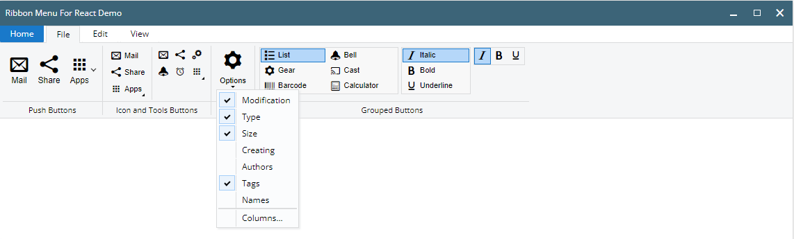
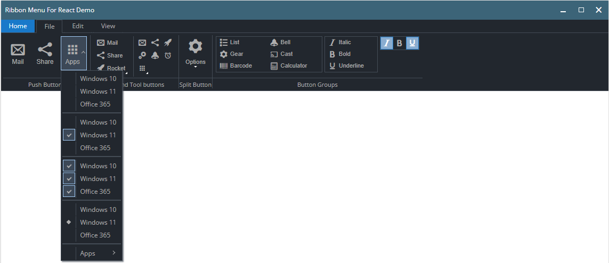

# Ribbon Menu for React




## Using
Root element
```jsx
<RibbonMenu>
    ...
</RibbonMenu>
```
Creating menu tabs
```jsx
<RibbonMenu>
    <RibbonTab label="Tab Name" mode={'static' | 'default'}>
        ...
    </RibbonTab>
    ...
</RibbonMenu>
```
### Ribbon Menu Elements
+ [x] RibbonButton
+ [x] RibbonToolButton
+ [x] RibbonIconButton
+ [x] RibbonSplitButton
+ [x] RibbonDropdownMenu
+ [x] RibbonButtonGroup

#### RibbonButton
```jsx
<RibbonButton caption={...} icon={...} image={...} title={...} onClick={...}/>
```
```jsx
<RibbonButton caption="Mail" icon="mif-envelop" title="Write Mail" onClick={()=>{}}/>
```

#### RibbonToolButton
```jsx
<RibbonToolButton caption={...} icon={...} image={...} onClick={...}/>
```
```jsx
<RibbonToolButton caption="Mail" icon="mif-envelop"/>
```

#### RibbonIconButton
```jsx
<RibbonIconButton caption={...} icon={...} image={...} title={...} onClick={...}/>
```
```jsx
<RibbonIconButton caption="Mail" icon="mif-envelop"/>
```

#### RibbonSplitButton
```jsx
<RibbonSplitButton caption="Options" icon="mif-cog">
    <RibbonDropdownMenu>
        ...
    </RibbonDropdownMenu>
</RibbonSplitButton>
```

#### RibbonDropdownMenu
```jsx
<RibbonDropdownMenu>
    <RibbonDropdownItem caption="Windows 10"/>
    <RibbonDropdownItem caption="Windows 11"/>
    <RibbonDropdownItem caption="Office 365"/>
    <RibbonDropdownDivider/>
    <RibbonDropdownCheckItem checked caption="Windows 10"/>
    <RibbonDropdownCheckItem checked caption="Windows 11"/>
    <RibbonDropdownCheckItem checked caption="Office 365"/>
    <RibbonDropdownDivider/>
    <RibbonButtonGroup active={[2]} radio>
        <RibbonDropdownItem caption="Windows 10"/>
        <RibbonDropdownItem caption="Windows 11"/>
        <RibbonDropdownItem caption="Office 365"/>
    </RibbonButtonGroup>
    <RibbonDropdownDivider/>
    <RibbonDropdown>
        <RibbonDropdownItem caption="Apps"/>
        <RibbonDropdownMenu>
            <RibbonDropdownItem caption="Windows 10"/>
            <RibbonDropdownItem caption="Windows 11"/>
            <RibbonDropdownItem caption="Office 365"/>
            <RibbonDropdownDivider/>
            <RibbonDropdownCheckItem checked caption="Windows 10"/>
            <RibbonDropdownCheckItem checked caption="Windows 11"/>
            <RibbonDropdownCheckItem checked caption="Office 365"/>
            <RibbonDropdownDivider/>
        </RibbonDropdownMenu>
    </RibbonDropdown>
</RibbonDropdownMenu>
```

#### Button with Dropdown Menu
```jsx
<RibbonDropdown>
    <RibbonIconButton caption="Rocket" icon="mif-rocket"/>
    <RibbonDropdownMenu>
        ...
    </RibbonDropdownMenu>
</RibbonDropdown>
```

#### RibbonButtonGroup
```jsx
<!-- Radio buttons -->
<RibbonButtonGroup radio  style={{width: "200px", maxHeight: "88px", }}>
    <RibbonIconButton caption="List" icon="mif-list"/>
    <RibbonIconButton caption="Gear" icon="mif-cog"/>
    <RibbonIconButton caption="Barcode" icon="mif-barcode"/>
    <RibbonIconButton caption="Bell" icon="mif-bell"/>
    <RibbonIconButton caption="Cast" icon="mif-cast"/>
    <RibbonIconButton caption="Calculator" icon="mif-calculator2"/>
</RibbonButtonGroup>

<!-- Check buttons -->
<RibbonButtonGroup style={{width: "100px"}}>
    <RibbonIconButton caption="Italic" icon="mif-italic"/>
    <RibbonIconButton caption="Bold" icon="mif-bold"/>
    <RibbonIconButton caption="Underline" icon="mif-underline"/>
</RibbonButtonGroup>

<!-- Preset active state -->
<RibbonButtonGroup active={[1, 3]}>
    <RibbonToolButton caption="Italic" icon="mif-italic"/>
    <RibbonToolButton caption="Bold" icon="mif-bold"/>
    <RibbonToolButton caption="Underline" icon="mif-underline"/>
</RibbonButtonGroup>
```

#### Dropdown Menu Checks Group

```jsx
<RibbonDropdownMenu>
    <RibbonButtonGroup active={2}>
        <RibbonDropdownItem caption="Windows 10" onClick={(e)=>{...}}/>
        <RibbonDropdownItem caption="Windows 11"/>
        <RibbonDropdownItem caption="Office 365"/>
    </RibbonButtonGroup>
</RibbonDropdownMenu>
```

#### Dropdown Menu Radio Group 
```jsx
<RibbonDropdownMenu>
    <RibbonButtonGroup active={2} radio>
        <RibbonDropdownItem caption="Windows 10" onClick={(e)=>{...}}/>
        <RibbonDropdownItem caption="Windows 11"/>
        <RibbonDropdownItem caption="Office 365"/>
    </RibbonButtonGroup>
</RibbonDropdownMenu>
```

<hr>

